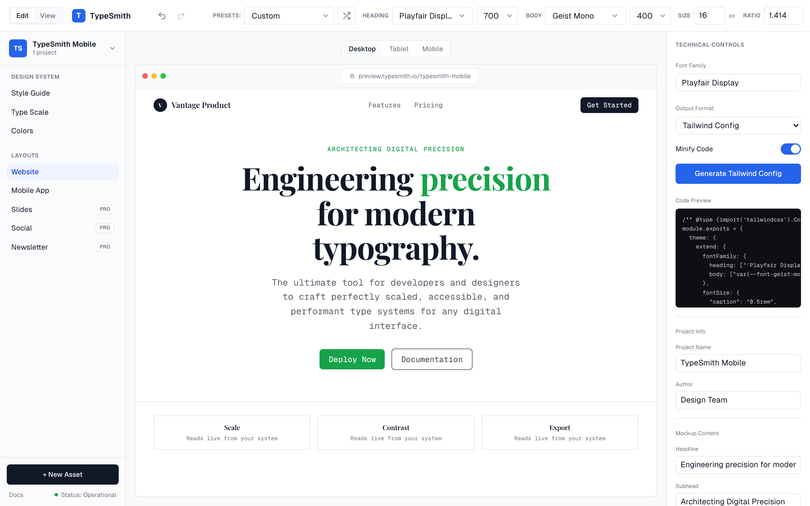

# TypeSmith

[](https://github.com/Akihito0/typesmith/actions/workflows/ci.yml)
[](https://github.com/Akihito0/typesmith/actions/workflows/deploy.yml)

Precision typography and UI design, in one tool. Build a modular type scale,
pair typefaces, prove accessibility, and watch the whole system render into
live mockups — all in the browser, with no signup and no server. The entire
project travels as a single shareable URL.



## Features

- **Type scale generator** — base size × ratio with 8 named presets, per-step
  overrides (click a size in the rail to pin it), draggable rail sliders,
  custom preview text, and font weight / leading / tracking controls.
- **Font pairing** — curated faces plus ~100 Google Fonts loaded on demand,
  searchable picker with in-face previews, session font upload
  (.woff/.woff2/.ttf/.otf), and one-click pairing presets with shuffle.
- **Accessibility proofing** — WCAG 2.1 and APCA (WCAG 3 draft) contrast, a
  matrix grading every text/surface pair, color-blindness simulation, and an
  auto-fixer that nudges a failing foreground to the nearest AA pass.
- **Live layouts** — website, mobile app, slide deck (with fullscreen present
  mode), social artboards (post, link card, 9:16 story), and an email
  newsletter with email-safe HTML download.
- **Style guide** — a client-facing summary of the whole system with
  print-to-PDF export.
- **Get code** — CSS variables, fluid `clamp()` CSS with configurable
  viewport bounds, Tailwind config, SCSS, JSON, and W3C Design Tokens.
- **Multi-project workspace** — autosave to localStorage, project switcher
  with duplicate/rename/delete, JSON backup export/import, undo/redo with
  coalesced history.
- **Shareable links** — the full project compresses into a `?s=` URL param
  (native deflate); opening a link recreates the project exactly.

## Run it

```bash
npm install
npm run dev      # http://localhost:3000
```

`npm run build && npm start` for production. Fully static and client-side —
deploys as-is to Vercel, Netlify, Cloudflare Pages, or GitHub Pages (the
included deploy workflow publishes to Pages on every push to main; enable it
once under Settings → Pages → Source: GitHub Actions).

## Scripts

| Script                  | What it does                                    |
| ----------------------- | ----------------------------------------------- |
| `npm run dev`           | Dev server on :3000                             |
| `npm run build`         | Production build                                |
| `npm run lint`          | ESLint (next/core-web-vitals)                   |
| `npm run format:check`  | Prettier check (`format` to write)              |
| `npm run typecheck`     | `tsc --noEmit`                                  |
| `npm test`              | Vitest unit tests over `lib/`                   |
| `npm run test:coverage` | Unit tests + coverage thresholds                |
| `npm run test:e2e`      | Playwright suite (build first; serves on :3100) |

Tip: to build while a dev server is running, use an isolated build dir:
`NEXT_DIST_DIR=.next-ci npm run build` — both writing `.next/` at once
corrupts it.

## Architecture

Everything hangs off one shared state object:

- `lib/store.ts` — the `ProjectState` (zustand): fonts, scale, overrides,
  weights, leading, colors, fluid bounds, mockup copy. Every panel, mockup,
  and export reads from here. Undo/redo history lives alongside.
- `lib/share.ts` — packs the whole state into a compressed base64url `?s=`
  param. New state fields must be added to `KEY_MAP` or they silently drop
  from share links.
- `lib/scale.ts`, `lib/contrast.ts`, `lib/export.ts` — framework-free math
  and code generation (modular + fluid scales, WCAG/APCA, six export
  formats). Fully unit-tested.
- `lib/workspace.ts` — the multi-project registry (localStorage).
- `app/editor` + `components/editor/` — the tool; `app/page.tsx` +
  `components/landing/` — the landing page, whose hero plays real editor
  screenshots back as a simulated working session.

No backend, no database, no env vars, no accounts — by design.

## License

MIT — see [LICENSE](LICENSE).
